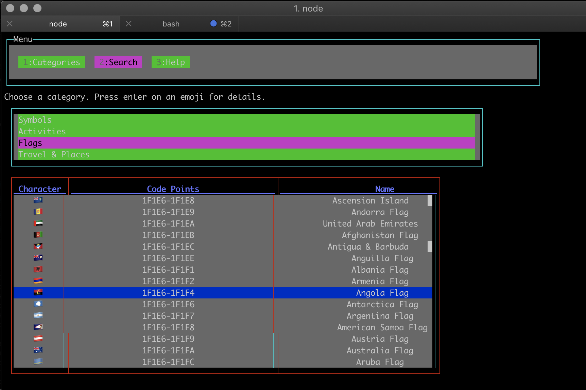

## Usage

```
npm i -g emojis-search
emojis-search
```

As it's an interactive application it doesn't accept any arguments so far


<!-- ## API

(to be moved to an independent project so it no required blessed and CLI related dependencies)

It provides a TypeScript enum so you can write code like the following:

```jsx
console.log(`I ${Emoji['🧡']} types.`);
export const PlayMessage = <box>Let's play {Emoji['🏀']} !</box>
``` -->

## Demo



## TODO

make a separate project with the enums and descriptions and make this consume that.