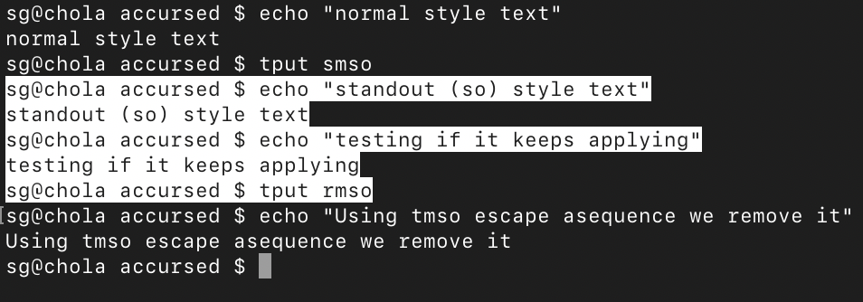
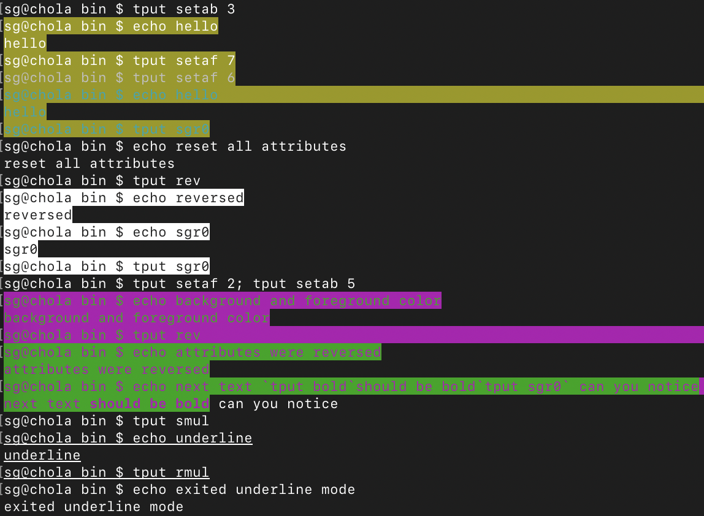
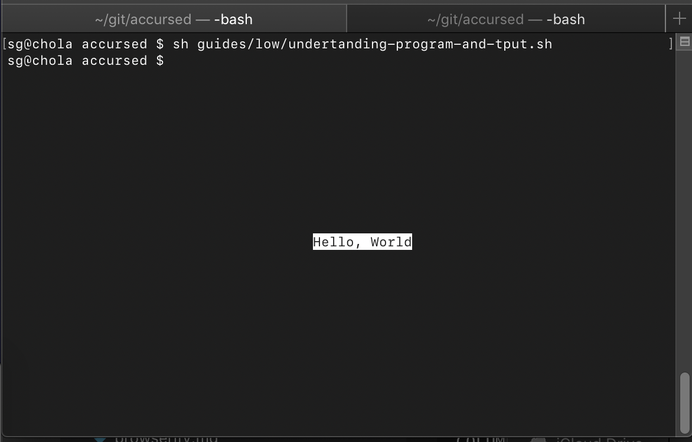
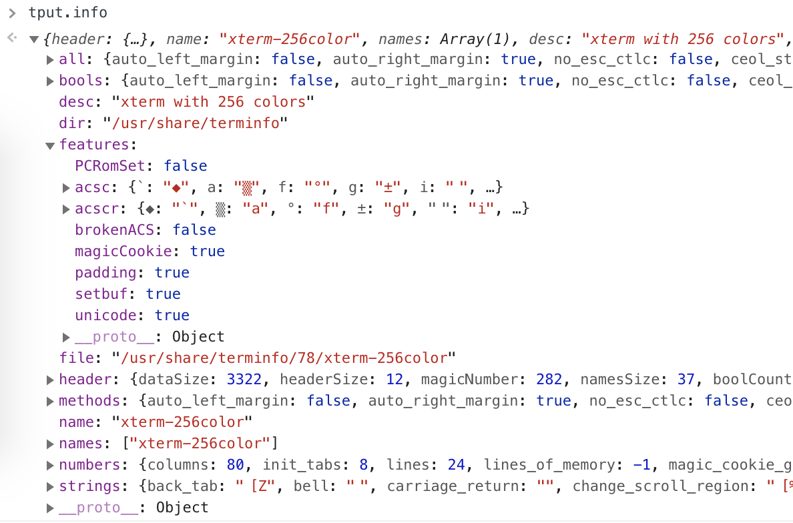

# Beginner's guide to get starting with tput and blessed Program 

(from a total beginner)

## tput

tput program has two main purposes:

 * query current system terminal's capabilities
 * provide a CLI API to manipulate these capabilities

blessed Program implements tput JavaScript and it's based on this API.

That's why,if we want to understand how Program works, is important to known tput basics. 

In the following examples you can use bleesed's tput instead of your system's by executing `node node_modules/blessed/bin/tput.js` instead of `tput` or by installing blessed globally `npm install -g blessed`

### Examples 

#### Enabling and removing modes

In the following example, we enable Standout Mode (so) with the command `tput smso`. As you can see after the mode is on, all the following input commands are affected until we turned off with the command `tput rmso`:
 


#### Changing background and foreground color:

As we did in previous example we can enable other modes, in this case the foreground and background colors:



#### Saving and restore cursor

The following commands cause the terminal to save the current cursor position, print `Hello, World' centered in the screen in reverse video, then return to the original cursor position.

```
COLUMNS=`tput cols`
LINES=`tput lines`
line=`expr $LINES / 2`
column=`expr \( $COLUMNS - 6 \) / 2`
tput sc
tput cup $line $column
tput rev
echo 'Hello, World'
tput sgr0
tput rc
```




### Getting started documents

These are some useful getting started documents: 

 * https://www.thegeekstuff.com/2011/01/tput-command-examples/
 * https://www.gnu.org/software/termutils/manual/termutils-2.0/html_chapter/tput_1.html


## tput JavaScript API

### enabling and disabling modes

The following program uses `tput smul` and `tput rmul` to enable / disable underline mode: 

```js
var blessed = require('blessed')
const tput = blessed.tput({
  terminal: process.env.TERM,
  termcap: !!process.env.USE_TERMCAP,
  extended: true
})
console.log(`Normal text
${tput.enter_underline_mode()}Underline text${tput.exit_underline_mode()}
Back to normal`);
```

### Listing all capabilities with tput.all


### Supported capabilities and information

#### tput.info

this object has information regarding all capabilities and the ones supported by this terminal and related inforamtion: 



#### tput.info.all

If the object `tput.all` or `tput.info.strings`, `tput.info.methods`don't contain a capability it's because is not supported by our current terminal. For example, in my terminal, `tput.enter_italics_mode()` function returns empty string and `tput.all.enter_italics_mode` is undefined, probably because my terminal doesn't support italics. 

## Blessed Program

 * blessed program exposes all of this methods and strings and delegates to program.tput instance
 * The file `lib/alias.js` contains descriptions for each capability and the alias names in program methods. 
 * accursed library has typings for tput object so it's easy to use it and learn